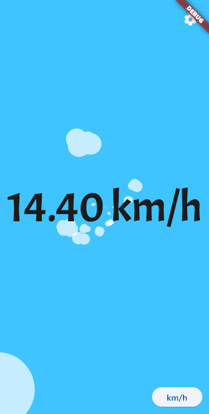
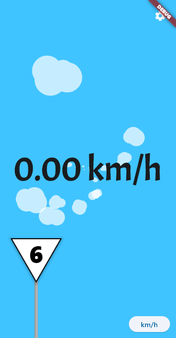
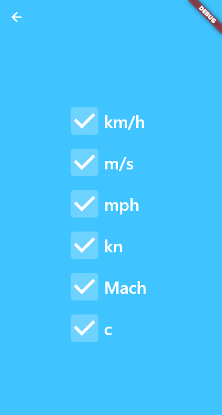

# I Am Speed

A mobile app that determines the current traveling speed with GPS. The app shows the speed in multiple units such as
km/h, mph, m/s, speed of sound (Mach) and speed of light (c). Additionally, the app uses the Open Street Map API to
show the maximum allowed speed if the user is travelling by train.

The app is written in Flutter and uses the geolocator plugin for the gps functionality. The app is currently only 
maintained for Android compilation.

To use the app the user must grant permissions to access the exact location (GPS). The options for the GPS position 
stream are "best" accuracy and distance filter 0. Therefor the app has a very high battery usage.

## Home Screen

The current speed is shown at the center of the screen. With the button in the bottom right corner you can cycle through
the speed units. The faster you go the faster the clouds in the background are moving. The gear icon in the top right
corner opens the settings page. \

Every 30 seconds the app checks the current location with the Open Street Map Overpass API and gets information about
the speed limit of train tracks at your location. If a speed limit is found, a little speed sign appears at the bottom
left to show you the maximum allowed speed. \

The gear icon in the top right corner opens the settings page.

## Settings Screen

Currently, the settings only contain a selection of the possible speed units which can be enabled and disabled. Due to 
the preferred use in the european area, mph is disabled by default. 

